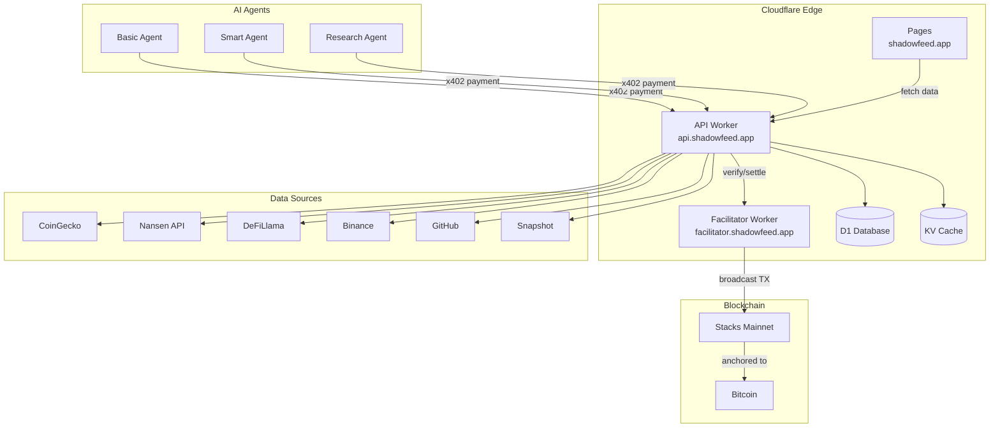

# Architecture Overview

ShadowFeed is built on Cloudflare's edge infrastructure with Stacks blockchain for payment settlement.

## System Diagram

## Components

### API Worker (`api.shadowfeed.app`)

- **Framework:** Hono (Cloudflare Workers-compatible)
- **Role:** Serves data feeds, handles x402 payment flow, provides dashboard API
- **Storage:** D1 (SQLite) for queries/stats, KV for cache + agent names

### Dashboard (`shadowfeed.app`)

- **Hosting:** Cloudflare Pages
- **Type:** Static SPA (single HTML file)
- **Features:** Live activity feed, agent leaderboard, feed registry, API playground, wallet connect

### Facilitator (`facilitator.shadowfeed.app`)

- **Framework:** Hono (Cloudflare Worker)
- **Role:** Verifies signed transactions and broadcasts them to Stacks blockchain
- **Endpoints:** GET /supported, POST /verify, POST /settle

### Smart Contract

- **Language:** Clarity
- **Network:** Stacks Mainnet
- **Purpose:** On-chain provider registry (v3)
- **TX:** `198e59303b69582bc4fcef5d284ea0c92264a856855755ee692605dc6dcd9042`

## Tech Stack

| Layer | Technology |
|-------|------------|
| **Edge Runtime** | Cloudflare Workers |
| **Web Framework** | Hono |
| **Database** | Cloudflare D1 (SQLite) |
| **Cache** | Cloudflare KV |
| **Static Hosting** | Cloudflare Pages |
| **Blockchain** | Stacks (Bitcoin L2) |
| **Smart Contracts** | Clarity |
| **Payment Protocol** | x402 v2 |
| **Agent SDK** | TypeScript (npm: `shadowfeed-agent`) |
| **External APIs** | CoinGecko, Nansen, DeFiLlama, Binance, GitHub, Snapshot, DEXScreener |

## Data Flow

1. **Agent → API:** HTTP GET with optional `payment-signature` header
2. **API → Facilitator:** POST /verify to validate payment, POST /settle to broadcast
3. **Facilitator → Stacks:** Broadcasts signed STX transfer via Hiro API
4. **Stacks → Bitcoin:** Transaction anchored to Bitcoin via Stacks consensus
5. **API → Data Sources:** Fetches real-time data from external APIs (cached in KV)
6. **API → D1:** Logs query metadata for activity feed and statistics
7. **API → Agent:** Returns feed data with payment receipt
