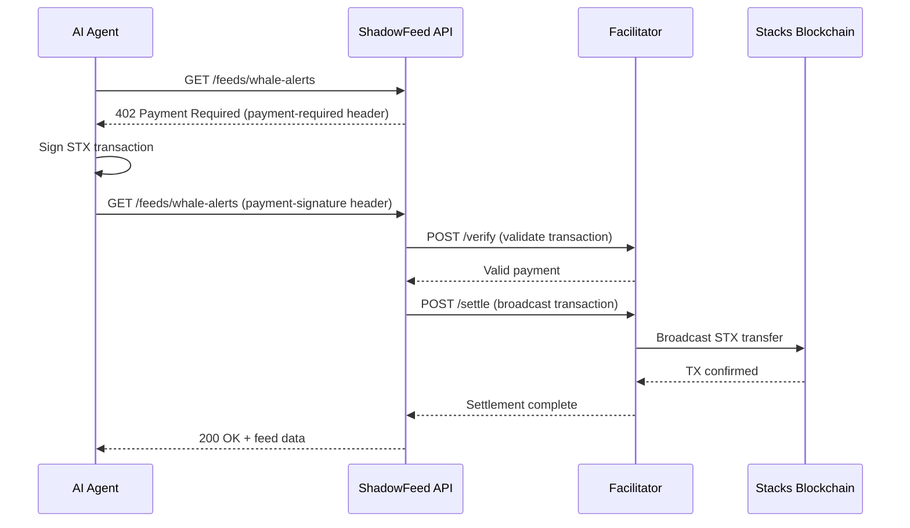

# How It Works

ShadowFeed uses the **x402 protocol** — an HTTP-native payment standard that enables machines to pay for API access without API keys or subscriptions.

## Payment Flow



## Step-by-Step

### 1. Agent Requests Data

The agent makes a normal HTTP GET request to a paid feed endpoint:

```
GET https://api.shadowfeed.app/feeds/whale-alerts
```

### 2. Server Returns 402

Since no payment is included, the server responds with `HTTP 402 Payment Required`:

```json
{
  "x402Version": 2,
  "resource": {
    "url": "https://api.shadowfeed.app/feeds/whale-alerts",
    "description": "Whale movements data",
    "mimeType": "application/json"
  },
  "accepts": [{
    "scheme": "exact",
    "network": "stacks:1",
    "amount": "5000",
    "asset": "STX",
    "payTo": "SP1DV3T4ST2A89ZZ07M73B2N4AR5XFMDCNPGKK6CS",
    "maxTimeoutSeconds": 300
  }]
}
```

The `payment-required` header contains this as a base64-encoded string.

### 3. SDK Signs Payment

The SDK automatically:
- Parses the 402 response
- Creates a STX transfer transaction for the exact amount
- Signs it with the agent's private key
- Retries the request with the signed transaction in the `payment-signature` header

### 4. Server Verifies & Settles

The server (or facilitator) verifies the signed transaction is valid:
- Correct amount
- Correct recipient
- Valid signature

Then broadcasts it to the Stacks blockchain for settlement.

### 5. Data Delivered

Once payment is confirmed, the agent receives the requested data. The transaction is permanently recorded on-chain and verifiable on [Hiro Explorer](https://explorer.hiro.so).

## Key Concepts

| Concept | Description |
|---------|-------------|
| **x402 Protocol** | HTTP-native payment protocol. Returns 402 status code when payment is required. |
| **Facilitator** | Service that verifies and settles payments on-chain. ShadowFeed runs its own at `facilitator.shadowfeed.app`. |
| **STX** | Native token of Stacks blockchain (Bitcoin L2). Used for all ShadowFeed payments. |
| **On-chain settlement** | Every payment is a real blockchain transaction, providing transparency and auditability. |
| **Pay-per-use** | No subscriptions, no API keys. Agents pay only for the data they consume. |

## Why x402?

- **No API keys** — Payment is the authentication
- **Machine-native** — Built for agent-to-agent commerce
- **Transparent** — Every transaction is on-chain and verifiable
- **Micro-amounts** — Feeds cost 0.003-0.08 STX (~$0.001-$0.03)
- **Bitcoin-secured** — Stacks settles on Bitcoin for maximum security
